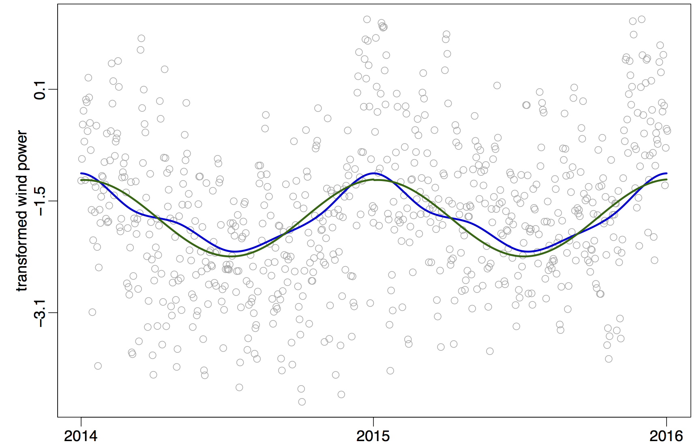
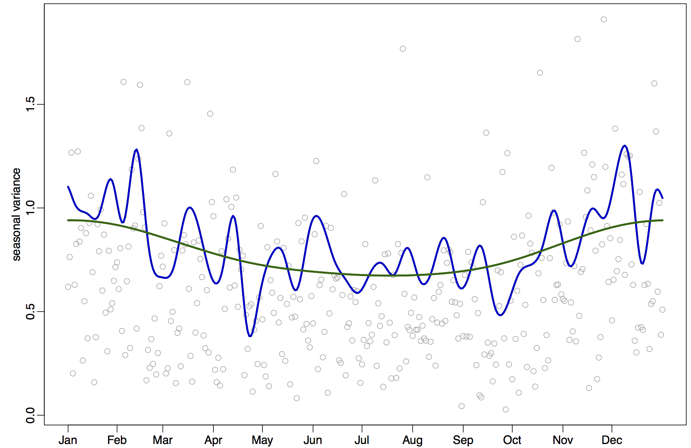
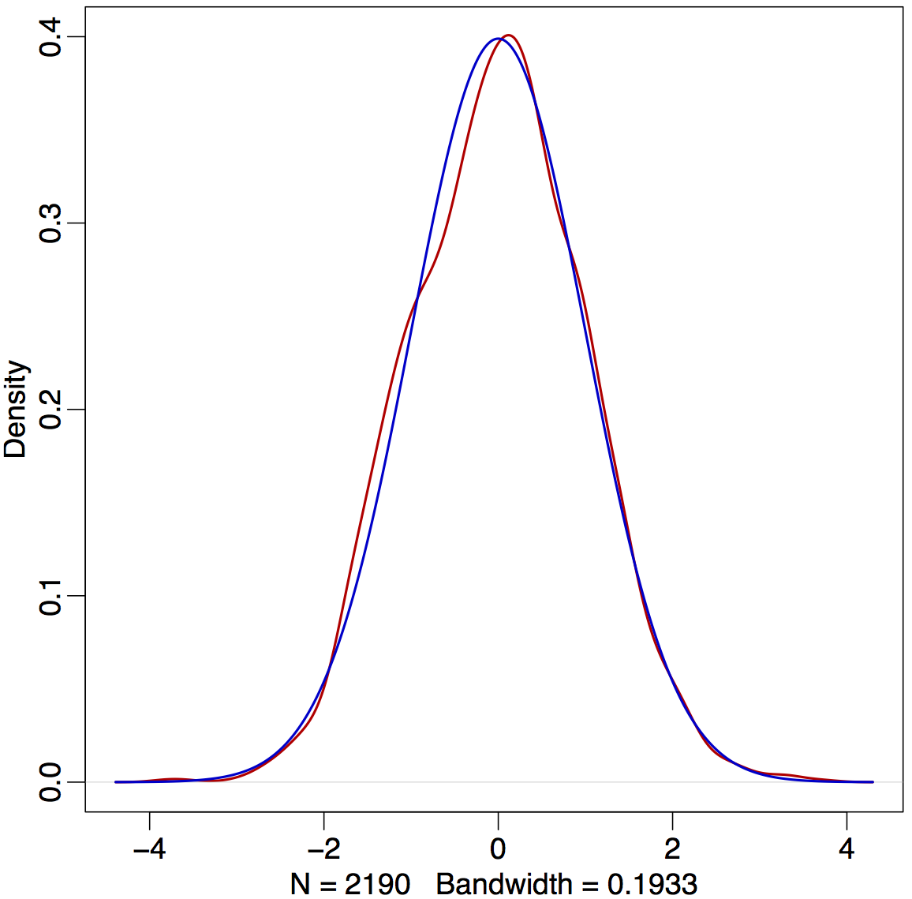
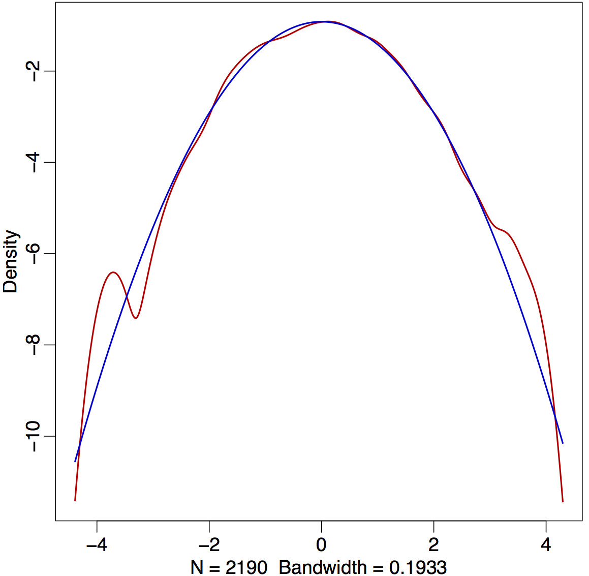
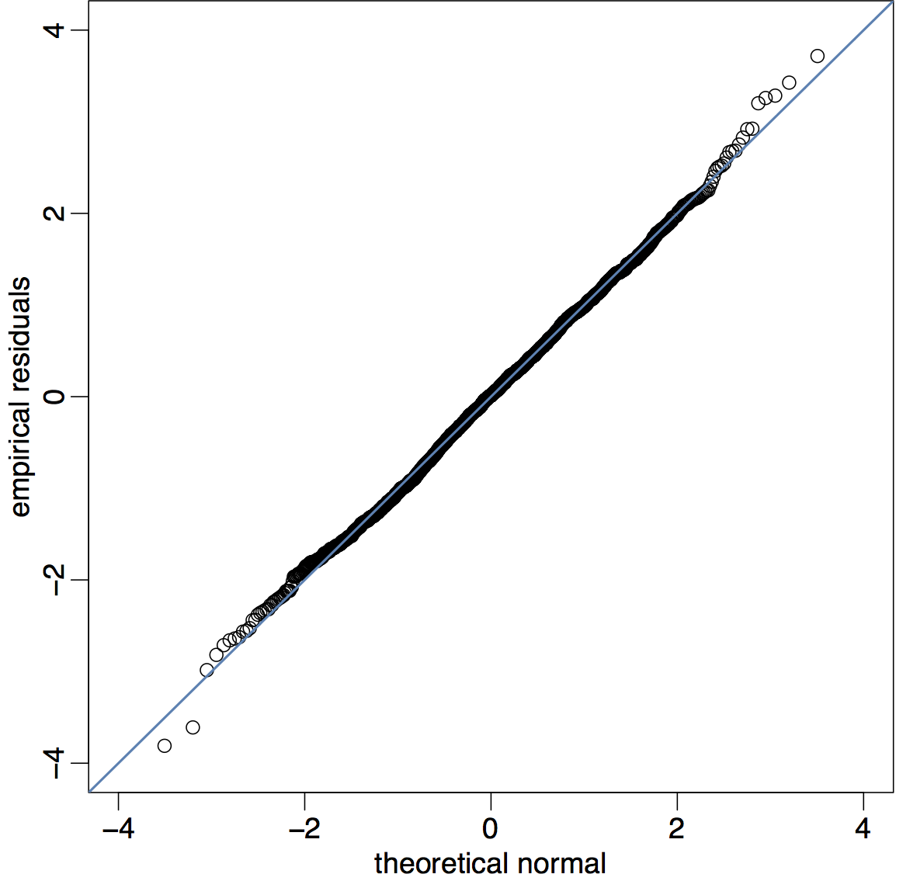

[](http://quantlet.de/index.php?p=info)

## [](http://quantlet.de/) **PGFP_add_Bs_IQR_logit** [](http://quantlet.de/d3/ia)


```yaml
Name of Quantlet: PGFP_add_Bs_IQR_logit

Published in: Pricing Green Financial Products  

Description: 'Normalisation of German wind power utilisation for stochastic pricing.' 

Keywords: 'normalization, seasonality, trend, time series, CARMA, Testing, IQR, IER, smoothing, B-splines, transformation' 

Author:   Awdesch Melzer 

Datafile: WP16.RData, WP1015.RData

Functions: periodic_bspline.R, garchAuto.R

Example: 'Normalisation' 

```






```R
##### DAILY #####
rm(list=ls(all=T))
graphics.off()

#setwd()

# install and load packages
libraries = c("latticeExtra","gplots","splines","scales", "matrixStats","zoo","lattice","viridis","akima","locpol","nlmrt","np","tseries","forecast","fArma","nortest","moments","KernSmooth","rugarch","fGarch","MASS","expectreg","tseries","FinTS","xtable","ghyp")
lapply(libraries, function(x) if (!(x %in% installed.packages())) {
  install.packages(x)
})
lapply(libraries, library, quietly = TRUE, character.only = TRUE)

# load adjusted box-cox-estimator

source("periodic_bspline.R")
# load data
load("WP1015.RData")

Y.n = Y.1015$utilisation
nm    = 6
Y.BCm = t(matrix(Y.n,96,365*nm))
YY= array(0,dim=c(365,96,nm))
peryear = c(seq(1,nrow(Y.BCm),by=365),nrow(Y.BCm)+1)
for(i in 1:nm){
  YY[,,i] = Y.BCm[peryear[i]:(peryear[i+1]-1),]
}

YY.n = apply(YY,c(1,3),mean)
Y.n = c(YY.n)

Lambda.X = log(Y.n/(1-Y.n))
plot(density(Lambda.X))
##### transformation #####
# 
# lambda.t     = (BoxCox.numeric(Y.n,interval=seq(-5,5)))                 # log|power transformation estimation
# lambda.1over = round(1/lambda.t)
# lambda.t     = 1/lambda.1over                                           # log|power transformation estimator
# Y.BC         = if(lambda.t!=0){(Y.n^lambda.t-1)/lambda.t}else{log(Y.n)} # Box-Cox-transformation
#Y.BC         = log(Y.n)
Y.BC         = Lambda.X
Y.BCm        = Y.BC
YY.BCm       = matrix(Y.BCm,365,nm)


##### SEASONALITY #####

YN1         = apply(YY.BCm,1,mean)

Bs          = get.pbas(365, S=365, dK= 365/6 ) # periodic splines Ziel (2014)
B.seas      = fitted(lm(YN1~Bs-1)) 

coef((lm(YN1~Bs-1)))

YY.Bs       = Y.BCm-rep(B.seas,nm)

par(cex=1.5)
acf(YY.Bs)
pacf(YY.Bs)


day         = 1:365
day1        = 1:(3*365)
nll         = nls(rep(YN1,3) ~ a + b*day1 + c1*cos(2*pi*(day1-d1)/365) + c2*cos(4*pi*(day1-d2)/365) ,start=list(a = 0.1, b = 0.1, c1=0.1,  d1=0.1,c2 = 0.1, d2=0.1),trace=F,control=list(minFactor=1e-99)) 
coefgl      = coef(nll)
TFseas      = coefgl[1] + coefgl[2]*day + coefgl[3]*cos(2*pi*(day-coefgl[4])/365) +  coefgl[5]*cos(2*pi*(day-coefgl[6])/365)
TFSEASm     = rep(TFseas, nm)
YY.TF       = Y.BCm-TFSEASm

par(c(1,1),cex =c(1.5), oma = c(0.5, 1, 0, 1), mar = c(2.5, 2.3, 1, 1), mgp = c(1.5, 0.5, 0))
plot(Y.BCm[(365*4):(365*6)], type="p", pch=1, col="darkgrey", xlab="", ylab="transformed wind power", frame=T, axes=F)
axis(1, at=c(1,365,2*365), labels=c(2014,2015,2016))
axis(2, at=round(seq(min(Y.BCm),max(Y.BCm),length=5),1))

lines(rep(B.seas,2), col="blue3", lwd=3)
lines(rep(TFseas,2), col="darkgreen", lwd=3)

ADF  = c()
KPSS = c()

ADF[1]  = adf.test(YY.Bs)$p.value
KPSS[1] = kpss.test(YY.Bs,null="Level")$p.value

ADF[2]  = adf.test(YY.TF)$p.value
KPSS[2] = kpss.test(YY.TF,null="Level")$p.value

ADF
KPSS

# lambda.t     = (BoxCox.numeric(YY.Bs,interval=seq(-5,5)))                 # log|power transformation estimation
# lambda.1over = round(1/lambda.t)
# lambda.t     = 1/lambda.1over                                           # log|power transformation estimator
# YY.Bs         = if(lambda.t!=0){(YY.Bs^lambda.t)}else{log(YY.Bs)} # Box-Cox-transformation
# #plot(density(Y.BC)$x,(density(Y.BC)$y))
# # Y.BC         = log(Y.n)
# YY.TF         = if(lambda.t!=0){(YY.TF^lambda.t)}else{log(YY.TF)} # Box-Cox-transformation

##### MODELLING STOCHASTIC PROCESS #####

# ARMA for periodic B splines

K = 9
aic = matrix(0, K,K)
bic = matrix(0, K,K)
for(i in 1:K){
  for(j in 1:(K)){
    if(i>j){
      arma.Bs = arima(c(YY.Bs),order=c(i-1,0,j-1),method="ML",include.mean=F)
      aic[i,j] = AIC(arma.Bs)
      bic[i,j] = BIC(arma.Bs)
    }else if(j>=i){
      aic[i,j] = 1e16
      bic[i,j] = 1e16
    }
  }
}
levelplot(bic)
id.aic = which(aic==min(aic),arr.ind=T)
id.bic = which(bic==min(bic),arr.ind=T)
p = id.bic[1,1]-1
q = id.bic[1,2]-1
arma.Bs = arima(c(YY.Bs),order=c(p,0,q),method="ML",include.mean=F)##auto.arima(c(YY.Bs),ic="aicc",allowmean=F)#
print(coefficients(arma.Bs))

# calculate volatility and squared vola
volatility.Bs   = (arma.Bs)$residuals
volatility.2.Bs = volatility.Bs^2
vola.a.Bs    = matrix(volatility.2.Bs,365,nm)
vol.Bs       = matrix(volatility.Bs,365,nm)

# ARMA for TFS
KT = 9
aicT = matrix(0, K,K)
bicT = matrix(0, K,K)
for(i in 1:KT){
  for(j in 1:(KT)){
    if(i>j){
      arma.T = arima(c(YY.TF),order=c(i-1,0,j-1),method="ML",include.mean=F)
      aicT[i,j] = AIC(arma.T)
      bicT[i,j] = BIC(arma.T)
    }else if(j>=i){
      aicT[i,j] = 1e16
      bicT[i,j] = 1e16
    }
  }
}
levelplot(bicT)
id.aicT = which(aicT==min(aicT),arr.ind=T)
id.bicT = which(bicT==min(bicT),arr.ind=T)

p.T = id.bicT[1,1]-1
q.T = id.bicT[1,2]-1
arma.TF = arima(c(YY.TF),order=c(p.T,0,q.T),method="ML",include.mean=F)##auto.arima(c(YY.TF),ic="aic",allowmean=F)#
print(coefficients(arma.TF))

# calculate volatility and squared vola
volatility.TF   = (arma.TF)$residuals
volatility.2.TF = volatility.TF^2


vola.a.TF    = matrix(volatility.2.TF,365,nm)
vol.TF       = matrix(volatility.TF,365,nm)

# VOLA with TFS
# 4-5
YNL1.TF       = apply(vola.a.TF,1,mean)
nll           = nls(YNL1.TF~a + b*day + c1*cos(2*pi*(day)/365) + c2*sin(2*pi*(day)/365) +c3*cos(4*pi*(day)/365) + c4*sin(4*pi*(day)/365) ,start=list(a = 0.1, b = 0.1, c1=0.1,  c2=0.1,c3 = 0.1, c4=0.1),trace=F,control=list(minFactor=1e-99))
coefgl        = coef(nll)
TFseas        = coefgl[1] + coefgl[2]*day + coefgl[3]*cos(2*pi*(day)/365) +  coefgl[4]*sin(2*pi*(day)/365)+ coefgl[5]*cos(4*pi*(day)/365) +  coefgl[6]*sin(4*pi*(day)/365)#+coefgl[3]*sin(2*pi*day/365)+coefgl[4]*cos(4*pi*day/365)+coefgl[5]*sin(4*pi*day/365)  
SEASm.vola.TF = rep(TFseas, nm)

ssl           = YNL1.TF - TFseas

ARCH = ArchTest(ssl)$p.value
if(ARCH[1]<0.05){
  # uncomment if GARCH is necessary:
  
  library(rugarch)
  
  spec   = ugarchspec(variance.model = list(model = "sGARCH",garchOrder=c(1,1),submodel=NULL, external.regressors = NULL, variance.targeting = FALSE),mean.model = list(armaOrder = c(0,0),include.mean=F),fixed.pars=list(omega=0))
  gal    = ugarchfit(spec=spec, data=ssl,solver.control=list(trace=0))
  #
  # # source("garchAuto.R")
  # # gal    = garchFit(formula=~garch(1,1),data=ssl)#garch(ssl,order=c(1,1),control=garch.control(maxiter=10000,trace=T))
  # # gal = garchAuto(ssl, cores=detectCores()-1, trace=TRUE)
  #
  (gal)
  #
  # # # spec   = ugarchspec(variance.model = list(model = "sGARCH",garchOrder=c(1,1),submodel=NULL, external.regressors = NULL, variance.targeting = FALSE),mean.model = list(armaOrder = c(0,0),include.mean=F))
  #
  # # # gal1 = ugarchfit(spec=spec, data=ssl,solver.control=list(trace=0))
  #
  # # # Check Eigenvalues / Singularity of the cov-matrix
  #
  #
  eigv = eigen(attr(gal,"fit")$cvar, symmetric=TRUE)$values
  #
  eigv[1]/eigv[2]
  # [1] 44.03143
  # # This last line tells that in this case, the parameters were not
  # # well estimated, because the largest eigenvalue of the
  # # parameter covariance matrix is roughly 44 times the smallest.
  # # This means that we are dealing with a covariance matrix that is not singular, but close.
  plot(YNL1.TF,type="l")
  ddl    = TFseas + c((gal@fit$sigma)) #+attr(gal,"sigma.t")
  lines(ddl)
  # #ddl[1] = ddl[2]
  # #dll = abs(ddl)
  # # check residuals > 0
  any((ddl<0))
  
  
  sml    = smooth.spline(ddl)
  lines(sml,col="red3",lwd=2)
  
  #########Checking Normality
  # for fourier
  dd1l      = rep(sqrt(ddl),nm)
  res3l     = resid.ar1.TF/dd1l
  
  skewness(res3l) 
  kurtosis(res3l) 
  
  adt.GARCH = ad.test(res3l)$p.value 
  
  jbt.GARCH = jarque.bera.test(res3l)$p.value 
  SWT.GARCH = shapiro.test(res3l[1:5000])$p.value
  CvM.GARCH = cvm.test(res3l)$p.value
  KST.GARCH = lillie.test(res3l)$p.value  
  
  source("garchAuto.R")
  divl    = YNL1/TFseas
  gl      = ugarchfit(data=divl,spec=spec)
  #gl      = garch(divl,order=c(1,1))
  gl = garchAuto(divl, cores=detectCores()-1, trace=TRUE)
  dddl    = TFseas*(gl@fit$sigma)
  #dddl[1] = dddl[2]
  smml    = smooth.spline(dddl)
  
  #for fourier * garch
  ddd1l = rep(sqrt(dddl),nm)
  res4l = resid.ar1.TF/ddd1l
  
  skewness(res4l)
  kurtosis(res4l)
  
  ad.test(res4l)
  
  jarque.bera.test(res4l) 
}

# JB statistic routine
optimal.IQR = function(param, vola.a, vola){
  library(VGAM)
  S.1 = apply(vola.a,1,quantile,0.75)
  S.2 = apply(vola.a,1,quantile,0.25)
  IQR = (S.1-S.2)/(2*qnorm(0.75))
  sIQR = ((smooth.spline(rep(IQR,3), spar=param)$y)[366:(2*365)])
  res     = vola/(rep(sIQR,6))
  jbt.IQR = - jarque.bera.test(res)$p.value
}

# sd routine
sdt = function(k, volatility.LL, Y.IER.m){
  res.IER = volatility.LL/(k*(rep(Y.IER.m,6)))
  sd.IER = abs(sd(res.IER)-1)
  return(sd.IER)
}

# IQR
Q.11 = apply(vola.a.Bs,1,quantile,0.75);Q.21 = apply(vola.a.Bs,1,quantile,0.25)
Q.15 = apply(vola.a.TF,1,quantile,0.75);Q.25 = apply(vola.a.TF,1,quantile,0.25) # vol.LL

# minimisation of JB statistic: sIQR
lambda1   = optimize(f=function(param){optimal.IQR(param,vola.a.Bs,volatility.Bs)},1,lower=0,upper=1)$minimum 
lambda5   = optimize(f=function(param){optimal.IQR(param,vola.a.TF,volatility.TF)},1,lower=0,upper=1)$minimum 

# normalised IQR
Y.IQR1   = (Q.11-Q.21)/(2*qnorm(0.75)) 
Y.IQR5   = (Q.15-Q.25)/(2*qnorm(0.75))

# CV-sIQR
sYIQR.cv1 =  ((smooth.spline(rep(Y.IQR1,3), cv=T)$y)[366:(2*365)])
sYIQR.cv5 =  ((smooth.spline(rep(Y.IQR5,3), cv=T)$y)[366:(2*365)])

# norm-sIQR
sYIQR.lambda1 =  ((smooth.spline(rep(Y.IQR1,3), spar=lambda1)$y)[366:(2*365)])
sYIQR.lambda5 =  ((smooth.spline(rep(Y.IQR5,3), spar=lambda5)$y)[366:(2*365)])

# minising distance of sd to 1: calculating kappa
kappa.Q11 = optimize(f=function(k){sdt(k,volatility.LL=volatility.Bs,Y.IER.m=sYIQR.lambda1)},0.1,lower=0,upper=100)$minimum
kappa.Q12 = optimize(f=function(k){sdt(k,volatility.LL=volatility.Bs,Y.IER.m=sYIQR.cv1)},0.1,lower=0,upper=100)$minimum
kappa.Q51 = optimize(f=function(k){sdt(k,volatility.LL=volatility.TF,Y.IER.m=sYIQR.lambda5)},0.1,lower=0,upper=100)$minimum
kappa.Q52 = optimize(f=function(k){sdt(k,volatility.LL=volatility.TF,Y.IER.m=sYIQR.cv5)},0.1,lower=0,upper=100)$minimum

# scaling seasonal vola
Y.IQR.m11 = kappa.Q11*sYIQR.lambda1
Y.IQR.m12 = kappa.Q12*sYIQR.cv1
Y.IQR.m51 = kappa.Q51*sYIQR.lambda5
Y.IQR.m52 = kappa.Q52*sYIQR.cv5

# normalising risk factors
res.IQR.11 = volatility.Bs/((rep(Y.IQR.m11,nm)))
res.IQR.12 = volatility.Bs/((rep(Y.IQR.m12,nm)))
res.IQR.51 = volatility.TF/((rep(Y.IQR.m51,nm)))
res.IQR.52 = volatility.TF/((rep(Y.IQR.m52,nm)))

# normality results
print(adt.IQR.11 <- ad.test(res.IQR.11)$p.value)
print(jbt.IQR.11 <- jarque.bera.test(res.IQR.11)$p.value)
print(SWT.IQR.11 <- shapiro.test(res.IQR.11)$p.value)
print(CvM.IQR.11 <- cvm.test(res.IQR.11)$p.value)
print(KST.IQR.11 <- lillie.test(res.IQR.11)$p.value)

print(adt.IQR.12 <- ad.test(res.IQR.12)$p.value)
print(jbt.IQR.12 <- jarque.bera.test(res.IQR.12)$p.value)
print(SWT.IQR.12 <- shapiro.test(res.IQR.12)$p.value)
print(CvM.IQR.12 <- cvm.test(res.IQR.12)$p.value)
print(KST.IQR.12 <- lillie.test(res.IQR.12)$p.value)

print(adt.IQR.51 <- ad.test(res.IQR.51)$p.value)
print(jbt.IQR.51 <- jarque.bera.test(res.IQR.51)$p.value)
print(SWT.IQR.51 <- shapiro.test(res.IQR.51)$p.value)
print(CvM.IQR.51 <- cvm.test(res.IQR.51)$p.value)
print(KST.IQR.51 <- lillie.test(res.IQR.51)$p.value)

print(adt.IQR.52 <- ad.test(res.IQR.52)$p.value)
print(jbt.IQR.52 <- jarque.bera.test(res.IQR.52)$p.value)
print(SWT.IQR.52 <- shapiro.test(res.IQR.52)$p.value)
print(CvM.IQR.52 <- cvm.test(res.IQR.52)$p.value)
print(KST.IQR.52 <- lillie.test(res.IQR.52)$p.value)

par(c(1,1),cex=1.2)
plot(YNL1.TF,col="darkgrey",ylab="seasonal variance",xlab="",axes=F,frame=T)#,ylim=c(0,))
axis(1,c(1,31,59,90,120,151,181,212,243,273,304,334),c("Jan","Feb","Mar","Apr","May","Jun","Jul","Aug","Sep","Oct","Nov","Dec"))
axis(2,at=seq(0,2,length=5))
lines(Y.IQR.m51,col="blue3",lwd=3,lty=1)
lines(Y.IQR.m52,col="darkgreen",lwd=3,lty=1)


sd(res.IQR.52)
mean(res.IQR.52)

graphics.off()
par(cex=1.5)
acf(res.IQR.11^2,lag.max = 100)

set.seed(2)
par(cex=1.5)
plot(density(res.IQR.51),lwd=2,col="red3",main="",ylim=c(0,0.4))
lines(density(res.IQR.51)$x,dnorm(density(res.IQR.51)$x,0,1),col="blue3",lwd=2)
set.seed(2)
#rnorm.d = rnorm(length(res.IER),mean(res.IER),sd(res.IER))
plot(density(res.IQR.51)$x,log(density(res.IQR.51)$y),lwd=2,col="red3",main="",type="l",ylab="Density",xlab=paste("N =", density(res.IQR.51)$n, " Bandwidth =", round(density(res.IQR.51)$bw,digits=4)))
lines(density(res.IQR.51)$x,log(dnorm(density(res.IQR.51)$x,0,1)),col="blue3",lwd=2)

qqnorm(res.IQR.51 ,ylab="empirical residuals",xlab="theoretical normal",xlim=c(-4,4),ylim=c(-4,4))
abline(a=0,b=1,lwd=2,col="steelblue")


set.seed(2)
par(cex=1.5)
plot(density(res.IQR.11),lwd=2,col="red3",main="",ylim=c(0,0.4))
lines(density(res.IQR.11)$x,dnorm(density(res.IQR.11)$x,0,1),col="blue3",lwd=2)
set.seed(2)
#rnorm.d = rnorm(length(res.IER),mean(res.IER),sd(res.IER))
plot(density(res.IQR.11)$x,log(density(res.IQR.11)$y),lwd=2,col="red3",main="",type="l",ylab="Density",xlab=paste("N =", density(res.IQR.11)$n, " Bandwidth =", round(density(res.IQR.11)$bw,digits=4)))
lines(density(res.IQR.11)$x,log(dnorm(density(res.IQR.11)$x,0,1)),col="blue3",lwd=2)

qqnorm(res.IQR.11 ,ylab="empirical residuals",xlab="theoretical normal",xlim=c(-4,4),ylim=c(-4,4))
abline(a=0,b=1,lwd=2,col="steelblue")

Box.test(res.IQR.11^2)

acf(res.IQR.11,lag.max = 1000)
pacf(res.IQR.11,lag.max = 1000)

acf(c(YY.Bs),lag.max = 10)
pacf(c(YY.Bs),lag.max = 10)
acf(volatility.Bs^2,lag.max = 100)
pacf(volatility.Bs^2,lag.max = 100)

# AIC
xtable(stepAIC.ghyp(res.IQR.11,silent=T)$fit.table,digits=3)

# Adjusted AIC criterion:
6218.001 + 2*sum(log(-1/(Y.n^2-Y.n)))

d.time = 1:(length(res.IQR.11)+1)
z = zooreg(d.time,start=as.Date("2010-01-01"))
z.time = time(z)
ixx1    = which(format(z.time,"%m-%d")!="02-29")
dates = z.time[ixx1]

windforpricing = data.frame(list(index = 1:length(res.IQR.11), date=paste0(substr(dates, 1,4),substr(dates, 6,7),substr(dates, 9,10)), DAWS=c(Y.n), BC = Y.BC , season = rep(B.seas,nm), DES=YY.Bs, vola=(Y.IQR.m11), vola2 = (Y.IQR.m11)^2,resnorm=res.IQR.11))#, trend = trend)
save(windforpricing,file="windforpricing.RData")

if(p == 2){
  # Matrix of CAR(2) coefficients
  alpha.1 = 2-coefficients(arma.Bs)[1];
  alpha.2=alpha.1-coefficients(arma.Bs)[2]-1;
  A=matrix(c(0, 1, -alpha.2, -alpha.1),2,2,byrow=T);
} else if(p==3){
  # Matrix of CAR(3) coefficients
  alpha.1 = 3-coefficients(arma.Bs)[1];
  alpha.2 = 2*alpha.1-coefficients(arma.Bs)[2]-3;
  alpha.3 = alpha.2+1-alpha.1-coefficients(arma.Bs)[3];
  A       = matrix(c(0, 1, 0, 0, 0, 1, -alpha.3, -alpha.2, -alpha.1),3,3,byrow=T);
} else if(p==4){
  # Matrix of CAR(4) coefficients
  alpha.1 = 4- coefficients(arma.Bs)[1]
  alpha.2 = 3*alpha.1 - coefficients(arma.Bs)[2] - 6
  alpha.3 = 4 + 2*alpha.2 - coefficients(arma.Bs)[3] - 3*alpha.1
  alpha.4 = alpha.3 - coefficients(arma.Bs)[4] - alpha.2 + alpha.1 - 1
  A       = matrix(c(0, 1, 0, 0, 0, 0, 1, 0, 0, 0, 0, 1, -alpha.4, -alpha.3, -alpha.2, -alpha.1),4,4,byrow=T)
}
pq = list(p=p, q=q)
save(pq,file="pq.RData")
d= eigen(A);

save(arma.Bs,file="armal.RData")

load("WP16.RData")
ixi = 1:365
dat.2016 = Y.16$date
dat.2016 = dat.2016[-which(is.na(dat.2016))]
Y.n   = Y.16$utilisation 
Y.n[which(is.na(Y.16$utilisation))] = Y.n[min(which(is.na(Y.16$utilisation)))-(4:1)]
Y.n = Y.n
nm    = 1
Y.BCm = t(matrix(Y.n,96,365*nm))
YY= array(0,dim=c(365,96,nm))
peryear = c(seq(1,nrow(Y.BCm),by=365),nrow(Y.BCm)+1)
for(i in 1:nm){
  YY[,,i] = Y.BCm[peryear[i]:(peryear[i+1]-1),]
}
Y.2016m = apply(YY,c(1,3),mean)
Y.n = Y.2016m
Y.BC.2016 = log(Y.n/(1-Y.n)) 
des.2016 = c(Y.BC.2016)-B.seas[ixi]

ar.2016 = Arima(des.2016,model=arma.Bs)
vola.2016 = residuals(ar.2016)
vola.2.2016 = vola.2016^2
vola.IQR = vola.2016/(Y.IQR.m11[ixi])
ad.test(vola.IQR)
jarque.bera.test(vola.IQR)

y.2016 = data.frame(list(index = 1:length(vola.IQR), date=paste0(substr(unique(dat.2016), 1,4),substr(unique(dat.2016), 6,7),substr(unique(dat.2016), 9,10)), DAWS=Y.2016m, BC=Y.BC.2016, season = B.seas[ixi], DES= des.2016 ,  vola=(Y.IQR.m11[ixi]), vola2 = (Y.IQR.m11[ixi])^2), resnorm=vola.2016/(Y.IQR.m11[ixi]))#, trend = trend[ixi])
save(y.2016,file="windforpricing2016.RData")

```